## A PascalM Compiler is a software to generate C code from PascalM syntax. 

## PascalM BNF
**program:**

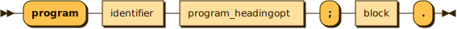

```
program  ::= 'program' identifier program_headingopt ';' block '.'
```

**program_headingopt:**

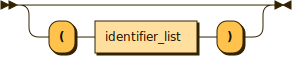

```
program_headingopt
         ::= ( '(' identifier_list ')' )?
```

referenced by:

* program

**identifier_list:**


```
identifier_list
         ::= identifier ( ',' identifier )*
```

referenced by:

* program_headingopt
* simple_type

**block:**

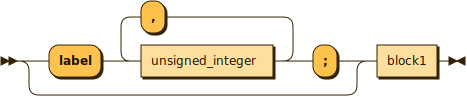

```
block    ::= ( 'label' unsigned_integer ( ',' unsigned_integer )* ';' )? block1
```

referenced by:

* block_or_forward
* program

**block1:**

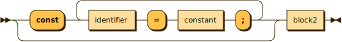

```
block1   ::= ( 'const' ( identifier '=' constant ';' )+ )? block2
```

referenced by:

* block

**block2:**

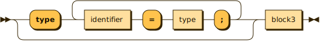

```
block2   ::= ( 'type' ( identifier '=' type ';' )+ )? block3
```

referenced by:

* block1

**block3:**

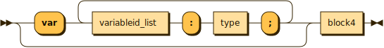

```
block3   ::= ( 'var' ( variableid_list ':' type ';' )+ )? block4
```

referenced by:

* block2

**block4:**

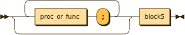

```
block4   ::= ( proc_or_func ';' )* block5
```

referenced by:

* block3

**block5:**

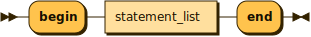

```
block5   ::= 'begin' statement_list 'end'
```

referenced by:

* block4

**variableid_list:**

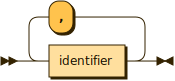

```
variableid_list
         ::= identifier ( ',' identifier )*
```

referenced by:

* block3

**constant:**

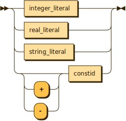

```
constant ::= integer_literal
           | real_literal
           | string_literal
           | ( '+' | '-' )? constid
```

referenced by:

* block1
* case_label_list
* simple_type

**type:**

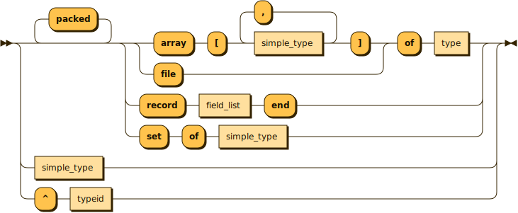

```
type     ::= simple_type
           | 'packed'* ( ( 'array' '[' simple_type ( ',' simple_type )* ']' | 'file' ) 'of' type | 'record' field_list 'end' | 'set' 'of' simple_type )
           | '^' typeid
```

referenced by:

* block2
* block3
* record_field
* type

**simple_type:**

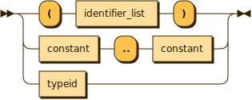

```
simple_type
         ::= '(' identifier_list ')'
           | constant '..' constant
           | typeid
```

referenced by:

* type

**field_list:**

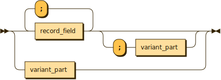

```
field_list
         ::= record_field ( ';' record_field )* ( ';' variant_part )?
           | variant_part
```

referenced by:

* type
* variant

**record_field:**

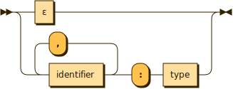

```
record_field
         ::= ε
           | identifier ( ',' identifier )* ':' type
```

referenced by:

* field_list

**variant_part:**

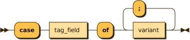

```
variant_part
         ::= 'case' tag_field 'of' variant ( ';' variant )*
```

referenced by:

* field_list

**tag_field:**

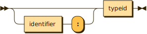

```
tag_field
         ::= ( identifier ':' )? typeid
```

referenced by:

* variant_part

**variant:**

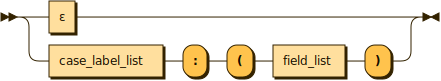

```
variant  ::= ε
           | case_label_list ':' '(' field_list ')'
```

referenced by:

* variant_part

**case_label_list:**

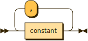

```
case_label_list
         ::= constant ( ',' constant )*
```

referenced by:

* case_element
* variant

**proc_or_func:**

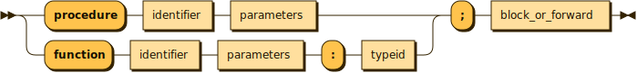

```
proc_or_func
         ::= ( 'procedure' identifier parameters | 'function' identifier parameters ':' typeid ) ';' block_or_forward
```

referenced by:

* block4

**block_or_forward:**

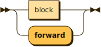

```
block_or_forward
         ::= block
           | 'forward'
```

referenced by:

* proc_or_func

**parameters:**

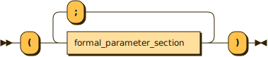

```
parameters
         ::= '(' formal_parameter_section ( ';' formal_parameter_section )* ')'
```

referenced by:

* formal_parameter_section
* proc_or_func

**formal_parameter_section:**


```
formal_parameter_section
         ::= ( 'var'? identifier ( ',' identifier )* | 'function' identifier parameters ) ':' typeid
           | 'procedure' identifier parameters
```

referenced by:

* parameters

**statement:**

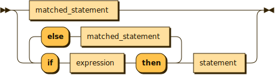

```
statement
         ::= matched_statement
           | 'if' expression 'then' ( matched_statement 'else' 'if' expression 'then' )* statement
```

referenced by:

* case_element
* case_else
* other_statement
* statement
* statement_list

**matched_statement:**

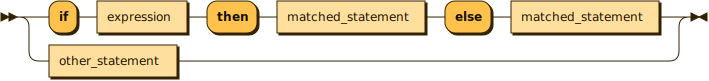

```
matched_statement
         ::= 'if' expression 'then' matched_statement 'else' matched_statement
           | other_statement
```

referenced by:

* matched_statement
* statement

**other_statement:**

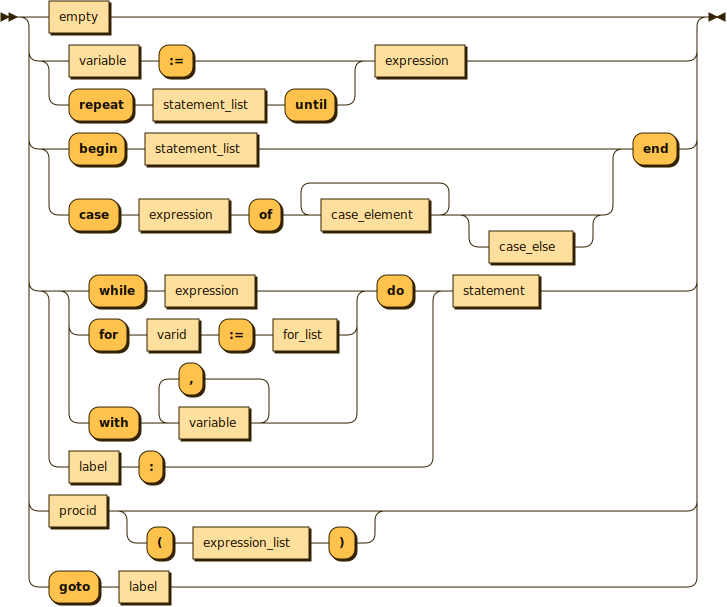

```
other_statement
         ::= empty
           | ( variable ':=' | 'repeat' statement_list 'until' ) expression
           | ( 'begin' statement_list | 'case' expression 'of' case_element+ case_else? ) 'end'
           | ( ( 'while' expression | 'for' varid ':=' for_list | 'with' variable ( ',' variable )* ) 'do' | label ':' ) statement
           | procid ( '(' expression_list ')' )?
           | 'goto' label
```

referenced by:

* matched_statement

**expression:**

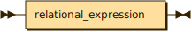

```
expression
         ::= relational_expression
```

referenced by:

* element
* expression_list
* for_list
* matched_statement
* other_statement
* primary_expression
* statement
* variable

**relational_expression:**

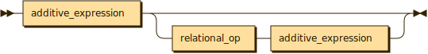

```
relational_expression
         ::= additive_expression ( relational_op additive_expression )?
```

referenced by:

* expression

**additive_expression:**

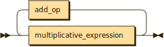

```
additive_expression
         ::= multiplicative_expression ( add_op multiplicative_expression )*
```

referenced by:

* relational_expression

**multiplicative_expression:**

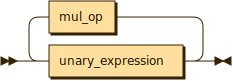

```
multiplicative_expression
         ::= unary_expression ( mul_op unary_expression )*
```

referenced by:

* additive_expression

**unary_expression:**

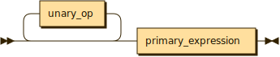

```
unary_expression
         ::= unary_op* primary_expression
```

referenced by:

* multiplicative_expression

**primary_expression:**

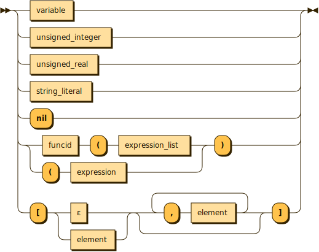

```
primary_expression
         ::= variable
           | unsigned_integer
           | unsigned_real
           | string_literal
           | 'nil'
           | ( funcid '(' expression_list | '(' expression ) ')'
           | '[' ( ε | element ) ( ',' element )* ']'
```

referenced by:

* unary_expression

**expression_list:**

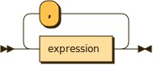

```
expression_list
         ::= expression ( ',' expression )*
```

referenced by:

* other_statement
* primary_expression

**element:**

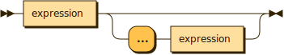

```
element  ::= expression ( '...' expression )?
```

referenced by:

* primary_expression

**relational_op:**

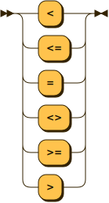

```
relational_op
         ::= '<'
           | '<='
           | '='
           | '<>'
           | '>='
           | '>'
```

referenced by:

* relational_expression

**add_op:**

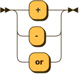

```
add_op   ::= '+'
           | '-'
           | 'or'
```

referenced by:

* additive_expression

**mul_op:**

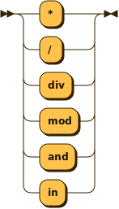

```
mul_op   ::= '*'
           | '/'
           | 'div'
           | 'mod'
           | 'and'
           | 'in'
```

referenced by:

* multiplicative_expression

**unary_op:**

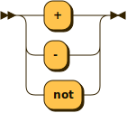

```
unary_op ::= '+'
           | '-'
           | 'not'
```

referenced by:

* unary_expression

**statement_list:**

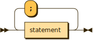

```
statement_list
         ::= statement ( ';' statement )*
```

referenced by:

* block5
* other_statement

**case_element:**

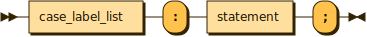

```
case_element
         ::= case_label_list ':' statement ';'
```

referenced by:

* other_statement

**case_else:**

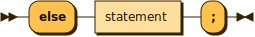

```
case_else
         ::= 'else' statement ';'
```

referenced by:

* other_statement

**for_list:**

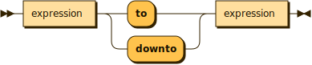

```
for_list ::= expression ( 'to' | 'downto' ) expression
```

referenced by:

* other_statement

**variable:**

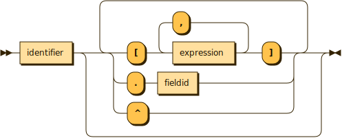

```
variable ::= identifier ( '[' expression ( ',' expression )* ']' | '.' fieldid | '^' )*
```

referenced by:

* other_statement
* primary_expression

**identifier:**

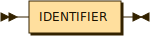

```
identifier
         ::= IDENTIFIER
```

referenced by:

* block1
* block2
* constid
* fieldid
* formal_parameter_section
* funcid
* identifier_list
* proc_or_func
* procid
* program
* record_field
* tag_field
* typeid
* variable
* variableid_list
* varid

**funcid:**


```
funcid   ::= identifier
```

referenced by:

* primary_expression

**procid:**

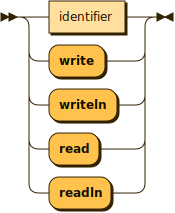

```
procid   ::= identifier
           | 'write'
           | 'writeln'
           | 'read'
           | 'readln'
```

referenced by:

* other_statement

**varid:**


```
varid    ::= identifier
```

referenced by:

* other_statement

**fieldid:**


```
fieldid  ::= identifier
```

referenced by:

* variable

**constid:**

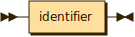

```
constid  ::= identifier
```

referenced by:

* constant

**typeid:**

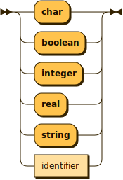

```
typeid   ::= 'char'
           | 'boolean'
           | 'integer'
           | 'real'
           | 'string'
           | identifier
```

referenced by:

* formal_parameter_section
* proc_or_func
* simple_type
* tag_field
* type

**unsigned_integer:**


```
unsigned_integer
         ::= INTEGER_LITERAL
```

referenced by:

* block
* primary_expression

**unsigned_real:**


```
unsigned_real
         ::= REAL_LITERAL
```

referenced by:

* primary_expression

**integer_literal:**

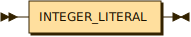

```
integer_literal
         ::= INTEGER_LITERAL
```

referenced by:

* constant

**real_literal:**

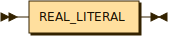

```
real_literal
         ::= REAL_LITERAL
```

referenced by:

* constant

**string_literal:**

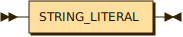

```
string_literal
         ::= STRING_LITERAL
```

referenced by:

* constant
* primary_expression

**char_literal:**

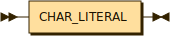

```
char_literal
         ::= CHAR_LITERAL
```

**boolean_literal:**

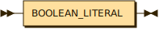

```
boolean_literal
         ::= BOOLEAN_LITERAL
```

**empty:**


```
empty    ::=
```

referenced by:

* other_statement
